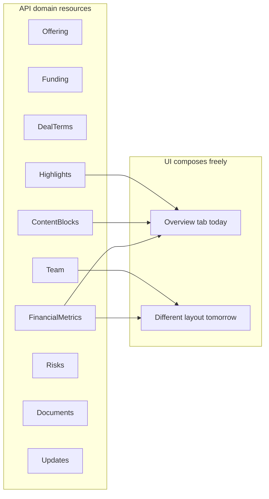

# Investment / Startup Explore API

## Goal

Provide public backend endpoints that power the marketing **Explore** flow: investment cards on the landing page and the full startup detail page at `/explore/{id}`.

## Scope

- Public read APIs backed by **domain resources** (not UI page sections).
- Normalized domain models, EF migration, seed data derived from current mock content.
- Integration tests for list + detail endpoints.

## Out Of Scope

- UI integration (React `antital-ui` still uses `investments.json` until a later checkpoint).
- Authenticated actions: invest, watchlist, ask question, like update (future work).
- Admin/fund-raiser CRUD for creating/editing listings.
- Secondary market endpoints.

---

## Design principle: domain-first, UI-agnostic

The API must **not** mirror frontend tabs (`overview`, `details`) or component names (`proprietaryEdge`, `marketTraction`). Those are presentation choices that will change.

Instead:

1. **Expose stable domain entities** — `TeamMember`, `FinancialMetric`, `Highlight`, `Risk`, etc.
2. **Let the UI compose pages** — today's "Overview" tab might tomorrow pull from `highlights` + `contentBlocks` + `financials`; the API shape stays the same.
3. **Store structured facts, not rendered layout** — e.g. financial metrics as `(name, period, value, currency)` not pre-built table columns/rows.
4. **Use generic content blocks** for narrative copy — problem statement, TL;DR, feature narratives share one model with a `blockType` / `key`, not one DTO per React component.



---

## Domain model (normalized)

### `InvestmentOffering` (aggregate root)

Core identity and list-card fields only.

| Field | Type | Notes |
|-------|------|-------|
| Id | Guid | |
| Slug | string | unique, URL-safe |
| Name | string | |
| Category | string | |
| Tagline | string | short description for cards |
| CoverImageUrl | string | |
| RiskLevel | enum | Low, Moderate, High |
| Status | enum | Draft, Published, Closed |
| DaysLeft | int | computed or stored campaign field |
| PublishedAt | DateTime? | |

List-card aggregates (`investors`, `raised`, `goal`, `percentage`, `minInvestment`) come from **Funding** (see below), not duplicated on the offering root.

### `OfferingFunding`

Campaign / raise mechanics (1:1 with offering).

| Field | Type |
|-------|------|
| OfferingId | Guid |
| RaisedAmount | decimal |
| FundingGoal | decimal |
| MinimumRaise | decimal? |
| InvestorCount | int |
| SharePrice | decimal |
| TargetRating | decimal? |
| MinInvestment | decimal |
| MaxInvestment | decimal |

`percentage` and `daysLeft` are **derived in the API layer** from funding + deadline, not stored as presentation fields.

### `DealTerms` (1:1)

| Field | Type |
|-------|------|
| TotalSharesOffered | long |
| PricePerShare | decimal |
| MinimumInvestment | decimal |
| MaximumInvestment | decimal |
| MinimumThreshold | decimal |
| FundingGoal | decimal |
| Deadline | DateTime |

### `Highlight` (1:many)

Reusable stat cards **and** bullet points — UI filters by `Kind`.

| Field | Type |
|-------|------|
| Id | Guid |
| OfferingId | Guid |
| Kind | enum | `Stat`, `Bullet` |
| Headline | string? | e.g. "₦675M ARR" — null for bullets |
| Body | string | description or bullet text |
| SortOrder | int |

Today's Overview tab uses `Kind=Stat` for cards and `Kind=Bullet` for numbered items. A future UI could show bullets elsewhere without an API change.

### `OfferingContentBlock` (1:many)

Generic narrative sections — replaces hardcoded `proprietaryEdge`, `marketTraction`, `problemTitle`, `tldr` DTOs.

| Field | Type |
|-------|------|
| Id | Guid |
| OfferingId | Guid |
| BlockType | enum | `ProblemStatement`, `Narrative`, `Tldr` |
| Key | string? | stable identifier e.g. `proprietary-edge`, `market-traction` — not tied to UI tab |
| Title | string? | |
| Summary | string? | intro paragraph |
| SortOrder | int |

### `ContentBlockItem` (1:many, child of block)

For narrative blocks with sub-points (today's FeaturePoint rows).

| Field | Type |
|-------|------|
| Id | Guid |
| ContentBlockId | Guid |
| Label | string |
| Body | string |
| SortOrder | int |

### `TeamMember` (1:many)

| Field | Type |
|-------|------|
| Id | Guid |
| OfferingId | Guid |
| Name | string |
| Title | string |
| Bio | string |
| ImageUrl | string? |
| SortOrder | int |

### `FinancialMetric` (1:many)

Structured facts — **UI builds tables/charts**.

| Field | Type |
|-------|------|
| Id | Guid |
| OfferingId | Guid |
| MetricName | string | e.g. "Annual Recurring Revenue (ARR)" |
| PeriodLabel | string | e.g. "FY 2024", "FY 2025 (Projected)" |
| PeriodSortOrder | int | column ordering hint |
| Value | decimal? | null → display "N/A" |
| Unit | enum | `Currency`, `Percent`, `Ratio`, `Text` |
| CurrencyCode | string? | e.g. NGN |
| ValueType | enum | `Actual`, `Projected` |

### `UseOfProceedsItem` (1:many)

| Field | Type |
|-------|------|
| Id | Guid |
| OfferingId | Guid |
| AllocationPercent | decimal? |
| Category | string |
| Description | string |
| SortOrder | int |

Optional `UseOfProceedsIntro` as a `ContentBlock` with `BlockType=Narrative`, `Key=use-of-proceeds-intro`.

### `Risk` (1:many)

| Field | Type |
|-------|------|
| Category | string |
| Description | string |
| Mitigation | string |
| SortOrder | int |

### `OfferingDocument` (1:many)

| Field | Type |
|-------|------|
| Title | string |
| FileUrl | string |
| DocumentType | enum | `Prospectus`, `FinancialModel`, `Other` |
| PageCount | int? |

### `MediaAsset` (1:many)

| Field | Type |
|-------|------|
| AssetType | enum | `CoverImage`, `Video`, `Thumbnail`, `Gallery` |
| Url | string |
| SortOrder | int |

### `OfferingUpdate` (1:many)

| Field | Type |
|-------|------|
| PublishedAt | DateTime |
| Title | string |
| Body | string |
| LikeCount | int |

### `Testimonial` (1:many)

| Field | Type |
|-------|------|
| Quote | string |
| AuthorName | string |
| AuthorTitle | string |
| ImageUrl | string? |
| SortOrder | int |

### `CorporateProfile` (1:1)

| Field | Type |
|-------|------|
| EntityType | string |
| Jurisdiction | string |
| IncorporationYear | int |
| RegistrationId | string |
| AdditionalNotes | string? |

---

## API contracts and endpoints available

### Response envelope (existing pattern)

```json
{
  "isSuccess": true,
  "value": { },
  "errors": []
}
```

### `GET /api/investments` — list offerings (public)

- **Auth**: none
- **Query**: `page`, `pageSize`, `category`, `risk`, `search`
- **Response**: paginated **list projection** only (denormalized for cards — acceptable here because it's a read-optimized view, not a page layout).

```json
{
  "items": [
    {
      "id": "uuid",
      "slug": "greentech-solutions",
      "name": "GreenTech Solutions",
      "category": "Clean Energy",
      "tagline": "Revolutionary solar panel technology with 40% higher efficiency",
      "coverImageUrl": "/investments/ayka_solar.jpg",
      "risk": "low",
      "investorCount": 234,
      "daysLeft": 234,
      "minInvestment": 1000,
      "raisedAmount": 450000,
      "fundingGoal": 1100000,
      "fundingProgressPercent": 45
    }
  ],
  "page": 1,
  "pageSize": 12,
  "totalCount": 12
}
```

### `GET /api/investments/{idOrSlug}` — offering shell (public)

Returns the **aggregate root + 1:1 children** needed for page chrome (header, funding panel, deal terms). Does **not** embed tab content.

```json
{
  "offering": {
    "id": "uuid",
    "slug": "greentech-solutions",
    "name": "GreenTech Solutions",
    "category": "Clean Energy",
    "tagline": "...",
    "coverImageUrl": "...",
    "risk": "low",
    "daysLeft": 14,
    "status": "published"
  },
  "funding": {
    "raisedAmount": 7381254,
    "fundingGoal": 25000000,
    "investorCount": 341,
    "sharePrice": 720,
    "targetRating": 4.5,
    "minInvestment": 5000,
    "maxInvestment": 250000,
    "fundingProgressPercent": 48
  },
  "dealTerms": {
    "totalSharesOffered": 99431817,
    "pricePerShare": 75,
    "minimumInvestment": 5000,
    "maximumInvestment": 250000,
    "minimumThreshold": 15000000,
    "fundingGoal": 25000000,
    "deadline": "2025-10-21T06:59:00Z"
  },
  "corporateProfile": {
    "entityType": "C-Corp",
    "jurisdiction": "Nigeria",
    "incorporationYear": 2024,
    "registrationId": "NEX-NG-800532"
  }
}
```

### Sub-resource endpoints (public)

Each returns a **domain collection**, independent of which UI tab consumes it.

| Method | Route | Returns |
|--------|-------|---------|
| GET | `/api/investments/{idOrSlug}/highlights` | `Highlight[]` |
| GET | `/api/investments/{idOrSlug}/content-blocks` | `OfferingContentBlock[]` (includes nested `items[]`) |
| GET | `/api/investments/{idOrSlug}/team` | `TeamMember[]` |
| GET | `/api/investments/{idOrSlug}/financials` | `{ metrics: FinancialMetric[], useOfProceeds: UseOfProceedsItem[] }` |
| GET | `/api/investments/{idOrSlug}/risks` | `Risk[]` |
| GET | `/api/investments/{idOrSlug}/documents` | `OfferingDocument[]` |
| GET | `/api/investments/{idOrSlug}/media` | `MediaAsset[]` |
| GET | `/api/investments/{idOrSlug}/updates?page=` | paginated `OfferingUpdate[]` |
| GET | `/api/investments/{idOrSlug}/testimonials` | `Testimonial[]` |

**UI mapping example (today's Overview tab — can change without API changes):**

| UI section | Domain source |
|------------|---------------|
| Problem statement | `content-blocks?` → `BlockType=ProblemStatement` |
| Highlights cards + bullets | `highlights` filtered by `kind` |
| Proprietary edge | `content-blocks` → `key=proprietary-edge` |
| Market traction | `content-blocks` → `key=market-traction` |
| TL;DR | `content-blocks` → `BlockType=Tldr` |
| Team | `team` |
| Financials table | `financials.metrics` grouped by `periodLabel` in UI |
| Risks | `risks` |

**Optional convenience (not required for v1):**

`GET /api/investments/{idOrSlug}?include=highlights,team,financials,...` — bundles sub-resources in one round trip while keeping **top-level domain keys**, never `overview` / `details`.

### Future authenticated endpoints

| Method | Route | Purpose |
|--------|-------|---------|
| POST | `/api/investments/{id}/watchlist` | Auth watchlist |
| POST | `/api/investments/{id}/invest` | Auth invest flow |
| GET/POST | `/api/investments/{id}/questions` | Q&A |

---

## Current observed behavior (pre-integration baseline)

- Landing renders cards from static `antital-ui/src/data/investments.json`.
- Detail page at `/explore/1` ignores card data; shows hardcoded NEXUS AI content per React component.
- No offering entities in `AntitalDBContext`.

## Checkpoints

| # | Checkpoint | Status |
|---|------------|--------|
| 1 | Domain models + migration + seed (normalized entities) | completed |
| 2 | `GET /api/investments` list endpoint + tests | completed |
| 3 | Offering shell + sub-resource read endpoints + tests | completed |

## Permission rule

Implement only the next `pending` checkpoint. Stop and request approval before continuing.

---

## Checkpoint 1 — Domain models + migration + seed

- [x] Status: completed

**UI trigger / entry point**

- Data layer for landing cards and detail page resources.

**API contract needed**

- Entity shapes above (not UI-shaped DTOs).

**Files to change**

- `Antital.Domain/Enums/` — `OfferingRiskLevel`, `OfferingStatus`, `HighlightKind`, `ContentBlockType`, `FinancialMetricUnit`, `FinancialValueType`, `MediaAssetType`, `DocumentType`
- `Antital.Domain/Models/` — entities listed in Domain Model section
- `Antital.Domain/Interfaces/IInvestmentOfferingRepository.cs`
- `Antital.Infrastructure/Repositories/InvestmentOfferingRepository.cs`
- `Antital.Infrastructure/AntitalDBContext.cs`
- `Antital.Infrastructure/Migrations/*AddInvestmentOfferings*.cs`
- `Antital.Infrastructure/Seed/InvestmentOfferingSeed.cs`

**Code plan**

1. Create normalized tables with FK to `InvestmentOffering` (no JSON blobs mirroring UI tabs).
2. Seed 6 list cards from `investments.json` + full detail data for at least one offering (GreenTech / NEXUS AI content mapped into domain entities).
3. Repository methods: list published, get shell by id/slug, get each child collection by offering id.

**Done criteria**

- Migration applies; seed data queryable per entity.
- Changing which tab a highlight appears on requires **zero** backend changes.

---

## Checkpoint 2 — List endpoint

- [x] Status: completed

**API contract needed**

- `GET /api/investments`

**Files to change**

- `Antital.Application/DTOs/Investments/*List*`
- `Antital.Application/Features/Investments/ListInvestments/*`
- `Antital.API/Controllers/InvestmentsController.cs`
- `Antital.Test/Integration/API/Controllers/InvestmentsControllerTests.cs`

**Done criteria**

- Returns card projection from `Offering` + `Funding`.
- Filter/pagination tests pass.

---

## Checkpoint 3 — Shell + sub-resource endpoints

- [x] Status: completed

**API contract needed**

- `GET /api/investments/{idOrSlug}`
- Sub-routes for highlights, content-blocks, team, financials, risks, documents, media, updates, testimonials

**Files to change**

- `Antital.Application/DTOs/Investments/*` (one DTO per domain entity)
- `Antital.Application/Features/Investments/GetOffering/*`
- `Antital.Application/Features/Investments/GetOfferingHighlights/*` (etc.)
- `Antital.API/Controllers/InvestmentsController.cs`
- Integration tests per route + 404 cases

**Done criteria**

- No response property named `overview` or `details`.
- UI can fetch shell + parallel sub-resources, or shell alone for SSR then hydrate tabs.
- Financial response uses `FinancialMetric[]` — not pre-rendered table rows.

---

## Readiness checklist

- [x] UI flow inspected (landing → detail → tabs).
- [x] API design revised to domain-first (not UI-mocked).
- [x] Normalized tables (not JSON UI blobs).
- [x] Branch: `features/fundraiser-listing-and-details`.
- [x] Checkpoint 1 completed.
- [x] Checkpoint 2 completed.
- [x] Checkpoint 3 completed.
